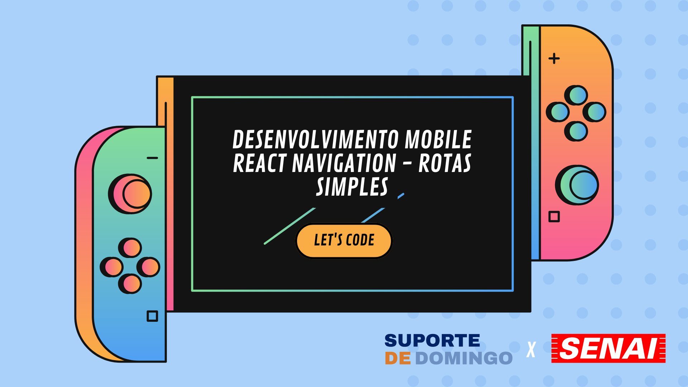
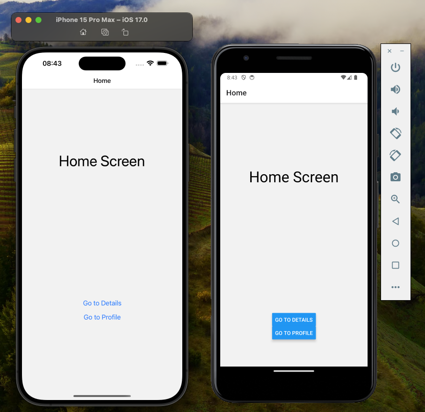

# Suporte de Expo com React Navigation

Este projeto é um exemplo básico de uma aplicação mobile usando Expo e React Navigation. O projeto implementa um sistema de navegação com três rotas principais: Home, Details, e Profile.




## Visão Geral

Este projeto foi criado para demonstrar como configurar e usar o React Navigation em um projeto Expo. As telas incluídas neste exemplo são simples e focadas em demonstrar a navegação entre diferentes telas.

## Estrutura do Projeto

A estrutura básica do projeto é a seguinte:

```
meuProjeto/
├── App.js
├── src/
│   ├── pages/
│   |   ├── HomeScreen.js
│   |   ├── DetailsScreen.js
│   |   └── ProfileScreen.js
├── node_modules/
├── package.json
└── README.md
```

## Funcionalidades

- **Home Screen**: Tela inicial do app com navegação para a Details Screen e Profile Screen.
- **Details Screen**: Tela de detalhes acessível a partir da Home Screen.
- **Profile Screen**: Tela de perfil acessível a partir da Home Screen e Details Screen.

## Tecnologias Utilizadas

- **Expo**: Plataforma para desenvolvimento de aplicativos móveis.
- **React Navigation**: Biblioteca para navegação em aplicativos React Native.

## Instalação

Para rodar este projeto localmente, siga os passos abaixo:

1. **Clone o Repositório**:

   ```bash
   git clone https://github.com/lucascorreaa/React-Navigation.Mobile
   cd React-Navigation.Mobile
   ```

2. **Instale as Dependências**:

   ```bash
   npm install
   ```

3. **Execute o Projeto**:

   ```bash
   expo start
   ```

4. **Na execução**:

   Quando rodar expo start, ele vai trazer a opção " s ", Expo Go, depois de selecionar essa, é só mirar seu celular no QRCODE lembrando que precisa ter o Expo Go instalado no celular, caso tenha emuladores no computador escolham android ou ios.

## Como Usar

1. Ao iniciar o aplicativo, você verá a **Home Screen**.
2. Use os botões para navegar para a **Details Screen** ou **Profile Screen**.
3. Você pode voltar à **Home Screen** ou navegar para outras telas usando a navegação integrada.

## Personalização

Você pode facilmente personalizar este projeto adicionando novas telas e rotas, ou ajustando o estilo e layout das telas existentes.

## Licença

Este projeto é de código aberto e está disponível sob a licença MIT.
